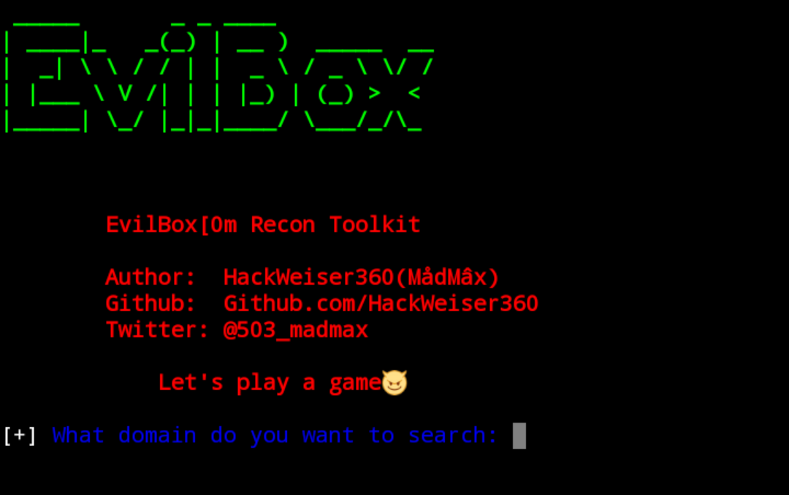

# EvilBox

EvilBox is a python Recon Toolkit script. It shows subdomain resolves to the IP addresses, company email addresses and much more ..!

Tu run EvilBox you only need a domain. Then EvilBox does the rest
## EvilBox shows the:
* Subdomain resolves to the IP addresses
* Ports
* HTTP Header
* Mail Servers
* DNS Text Records
* Nameserver Records
* List of GitHub user pages
* List of possible company email addresses harvested from GitHub user pages and from DuckDuckGo and Linkedin searches

***DISCLAIMER:IN NO WAY WILL HACKWEISER360 BE RESPONSIBLE FOR ANY HARM OR DAMAGE CAUSED BY EVILBOX. USE FOR EDUCATIONAL PURPOSES ONLY***
***
## [+] Installation and Usage
* $ pkg install git
* $ pkg install python
* $ pkg install python2
* $ pkg install python3
* $ git clone https://github.com/HackWeiser360/EvilBox
* $ cd EvilBox
* $ pip3 install -r requirements.txt
* $ python3 EvilBox.py
***

## Follow me

<a href="https://www.instagram.com/madmax4708/" target="_blank">

### Stargazers
